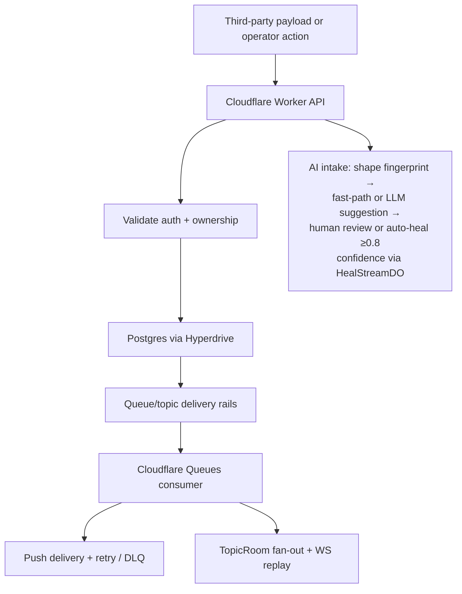

# IngestLens

**AI-assisted integration observability for payload intake, mapping, delivery, and replay-aware debugging.**

Built solo by [Ozby](https://github.com/ozby) as a portfolio of integration primitives — drift detection, mapping revisions, classified delivery, and a measurement harness for delivery semantics.

## Architecture



Full system view: [`docs/system-architecture.md`](docs/system-architecture.md).

## Consistency Lab

`apps/lab` runs controlled workloads through Cloudflare Queues, Postgres polling, and Postgres LISTEN/NOTIFY, surfacing correctness and latency measurements. Gated by a runtime kill switch and a $50/day cost ceiling.

## Quick start

```bash
pnpm install
pnpm dev                     # starts all dev servers with Doppler secrets
```

Secrets and database connections are managed via `with-secrets` (Doppler + Neon providers). No `.env` files.

## E2E

```bash
pnpm e2e --suite foundation
pnpm e2e --suite full
```

Zero manual env vars. The runner provisions a Neon branch, migrates, starts wrangler, runs tests, and cleans up — all automatically.

Suites: `foundation`, `auth`, `messaging`, `hardening`, `intake`, `demo`, `client`, `branding`, `full`.

Neon branch helpers (run via Doppler wrapper):

```bash
with-secrets --doppler ozby-shell:dev -- pnpm --dir apps/e2e db:branch:list
with-secrets --doppler ozby-shell:dev -- pnpm --dir apps/e2e db:branch:create
with-secrets --doppler ozby-shell:dev -- pnpm --dir apps/e2e db:branch:cleanup
```

## Local GitHub Actions testing

```bash
pnpm act:list
pnpm act:ci
pnpm act:e2e
pnpm act:cleanup
```

Uses a Doppler-backed wrapper (`scripts/act-with-doppler.ts`) that injects secrets from Doppler into `act` containers.

## Verify

```bash
pnpm check                  # format + lint + typecheck
pnpm test
pnpm build
pnpm docs:check
pnpm blueprints:check
```

## Delivery rails

- **Queues** — direct message delivery
- **Topics** — fan-out to subscribed queues
- **Push delivery** — transient errors use exponential backoff; permanent errors route to DLQ immediately
- **Durable Objects** — topic fan-out and short reconnect replay

Full contract: [`docs/delivery-guarantees.md`](docs/delivery-guarantees.md).

## Deploy

```bash
bun ./infra/src/deploy/deploy.ts dev   # api.dev.ingest-lens.ozby.dev + dev.ingest-lens.ozby.dev
bun ./infra/src/deploy/deploy.ts prd   # api.ingest-lens.ozby.dev     + ingest-lens.ozby.dev
```

**Smoke check:**

```bash
curl -sI https://dev.ingest-lens.ozby.dev | grep -E 'HTTP|content-type'
curl -s https://api.dev.ingest-lens.ozby.dev/health
```

**Rollback:** `wrangler rollback --env <stack>`

## Docs

- [System architecture](docs/system-architecture.md)
- [Architecture](docs/architecture.md)
- [Delivery guarantees](docs/delivery-guarantees.md)
- [Scale considerations](docs/scale-considerations.md)
- [ADR index](docs/adrs/README.md)
- [Blueprints](blueprints/README.md)
- [Roadmap](ROADMAP.md)
