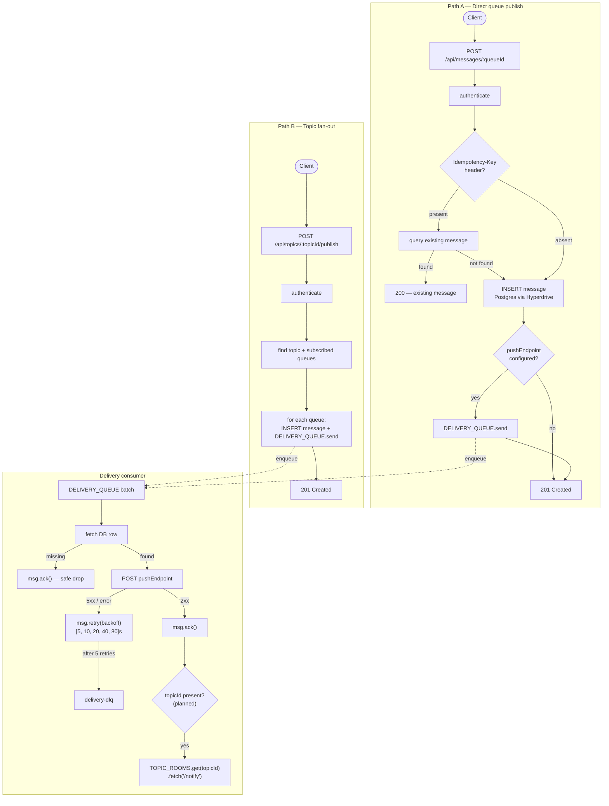

# node-pubsub

A serverless pub/sub platform built on Cloudflare's edge primitives — exploring where each one's
consistency guarantees break down.



## Key design decisions

| Decision      | Choice                       | Trade-off                                                                                                                   |
| ------------- | ---------------------------- | --------------------------------------------------------------------------------------------------------------------------- |
| Runtime       | Cloudflare Workers           | No idle cost, 30s CPU limit — [ADR 001](docs/decisions/001-cloudflare-workers-runtime.md)                                   |
| Delivery      | Cloudflare Queues            | At-least-once, ack/retry built-in — [ADR 002](docs/decisions/002-cloudflare-queues-delivery.md)                             |
| Database      | Postgres via Hyperdrive      | PoP-level connection pooling solves V8 isolate TCP problem — [ADR 003](docs/decisions/003-hyperdrive-connection-pooling.md) |
| Rate limiting | CF Workers binding (per-PoP) | Sub-ms decisions, not a global quota system — [ADR 004](docs/decisions/004-per-pop-rate-limiting.md)                        |
| Real-time     | Durable Objects fan-out      | Actor model, single-writer, hibernation economics — [ADR 005](docs/decisions/005-durable-objects-fan-out.md)                |

## Quick start

```bash
pnpm install
pnpm --filter @repo/workers dev     # wrangler dev (local Postgres via DATABASE_URL)
pnpm --filter @repo/workers test    # vitest
pnpm --filter @repo/workers check-types  # tsgo --noEmit
```

## E2E surface

The repo now owns its E2E seam via a root `agent-kit.config.ts`, the `apps/e2e`
host adapter, and the `packages/neon` branch helpers.

Current live suites:

- `foundation` — worker health smoke
- `auth` — register / login / session recovery
- `messaging` — queue send/receive/ack and topic publish fanout
- `full` — runs the full live HTTP suite in one invocation

```bash
pnpm exec ak e2e --suite foundation --print-command
E2E_BASE_URL=http://127.0.0.1:8787 pnpm exec ak e2e --suite full
pnpm --filter @repo/e2e db:branch:list
```

Local `auth`, `messaging`, and `full` runs require a migrated local Postgres
schema plus `wrangler dev --var JWT_SECRET:e2e-test-secret`.

Neon branch commands and the cleanup workflow read `NEON_API_KEY`,
`NEON_PROJECT_ID`, and `NEON_PARENT_BRANCH_ID` from Doppler-backed shell env.

## Local GitHub Actions testing

Use `act` through the Doppler-backed wrapper so local workflow runs receive the
same secret surface shape as CI.

```bash
pnpm act:list
pnpm act:ci
pnpm act:e2e
pnpm act:cleanup
```

The wrapper loads secrets from Doppler sources (`node-pubsub:dev`,
`ozby-shell:dev`) only when the selected workflow needs them, filters the
result through a least-privilege secret profile, never forwards
`DOPPLER_TOKEN` into the `act` container, mounts absolute local `file:/...`
package sources into the act job container, and automatically adds
`--container-architecture linux/amd64` on Apple Silicon.

Current profiles:

- `none` — default for local CI and local E2E harness runs; injects nothing
- `neon-control-plane` — used for Neon branch cleanup; injects only
  `NEON_API_KEY`, `NEON_PROJECT_ID`, and `NEON_PARENT_BRANCH_ID`

Use `--secret-profile <profile>` when you need to override the inferred
workflow profile explicitly.

On hosted GitHub Actions, the scheduled Neon cleanup workflow now prefers
`DOPPLER_TOKEN` + `dopplerhq/secrets-fetch-action@v2.0.0` and only falls back
to direct `NEON_*` repository secrets when a manager token is not configured
yet.

`pnpm act:e2e` targets the local-host harness workflow
`.github/workflows/testing-e2e-act.yml`, which is shaped for `act` and expects a
local Postgres instance reachable at `host.docker.internal:5432`.

## Docs

- [Architecture](docs/architecture.md) — system design walk-through
- [Delivery guarantees](docs/delivery-guarantees.md) — at-least-once contract, idempotency keys, backoff, DLQ
- [Scale considerations](docs/scale-considerations.md) — where it breaks and what to do about it
- [Decisions](docs/decisions/) — architecture decision records

## API reference

| Method | Path                             | Auth   | Description                                        |
| ------ | -------------------------------- | ------ | -------------------------------------------------- |
| POST   | `/api/auth/register`             | —      | Create user account                                |
| POST   | `/api/auth/login`                | —      | Authenticate, receive JWT                          |
| GET    | `/api/auth/me`                   | Bearer | Current user                                       |
| POST   | `/api/queues`                    | Bearer | Create queue (optional `pushEndpoint`)             |
| GET    | `/api/queues`                    | Bearer | List owned queues                                  |
| GET    | `/api/queues/:id`                | Bearer | Get queue                                          |
| DELETE | `/api/queues/:id`                | Bearer | Delete queue                                       |
| POST   | `/api/messages/:queueId`         | Bearer | Publish message; supports `Idempotency-Key` header |
| POST   | `/api/topics`                    | Bearer | Create topic                                       |
| GET    | `/api/topics`                    | Bearer | List owned topics                                  |
| POST   | `/api/topics/:topicId/subscribe` | Bearer | Subscribe a queue to a topic                       |
| POST   | `/api/topics/:topicId/publish`   | Bearer | Fan-out publish to all subscribed queues           |
| GET    | `/api/topics/:topicId/ws`        | Bearer | WebSocket upgrade — planned                        |
| GET    | `/api/dashboard`                 | Bearer | Server and queue metrics                           |
| GET    | `/health`                        | —      | Health check                                       |

## Stack

| Layer              | Technology                                               |
| ------------------ | -------------------------------------------------------- |
| Runtime            | Cloudflare Workers (Hono)                                |
| Database           | Postgres + Drizzle ORM, pooled via Cloudflare Hyperdrive |
| Async delivery     | Cloudflare Queues                                        |
| Real-time fan-out  | Cloudflare Durable Objects — planned                     |
| Rate limiting      | Cloudflare Rate Limiting binding — planned               |
| Delivery telemetry | Cloudflare Analytics Engine — planned                    |
| Test runner        | Vitest                                                   |
| Type checker       | `tsgo` (`@typescript/native-preview`)                    |
| Secrets            | Doppler — no `.env` files                                |

## Roadmap

Feature work is tracked as self-contained blueprints in [`blueprints/`](./blueprints/).
Each blueprint has an explicit dependency graph, TDD steps, and verification gates.

| Blueprint                                                            | Status    |
| -------------------------------------------------------------------- | --------- |
| `workers-hono-port` — hard-cut Express → Hono on CF Workers          | completed |
| `cf-queues-delivery` — Cloudflare Queues consumer with ack/retry     | completed |
| `cf-rate-limiting` — per-PoP rate limiting on authenticated routes   | planned   |
| `analytics-engine-telemetry` — delivery metrics via Analytics Engine | planned   |
| `durable-objects-fan-out` — WebSocket fan-out via TopicRoom DO       | planned   |
| `message-replay-cursor` — durable replay cursor on TopicRoom DO      | planned   |
