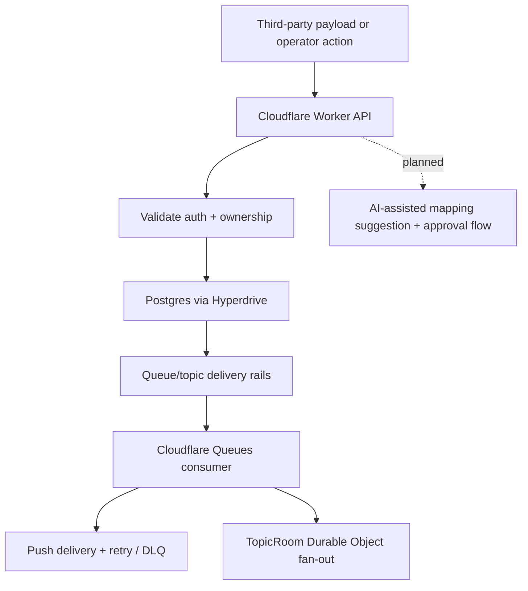

# IngestLens

**AI-assisted integration observability for payload intake, mapping, delivery, and replay-aware debugging.**

IngestLens is a Cloudflare-first showcase for a common IntegrationOps problem:
third-party payloads drift, operators need help mapping them safely, and the
underlying delivery rails still need honest, observable guarantees.

## What is shipped vs. partial vs. planned?

| State       | What it means here                                                                                                                                                          |
| ----------- | --------------------------------------------------------------------------------------------------------------------------------------------------------------------------- |
| **Shipped** | Worker auth, owned queues/topics, push delivery, pull receive leases, dashboard metrics, and route/client contract alignment are implemented in this repo today.            |
| **Partial** | The current UI and docs now frame the product as IngestLens, but the intake-mapping review workflow is not fully built yet.                                                 |
| **Planned** | AI-assisted mapping suggestions, canonical demo-guide flows, and the public dataset ingestion story are tracked as blueprints, not presented as completed product features. |

## The product in 30 seconds

- **Input:** messy third-party payloads that need review before they can be
  trusted.
- **Control plane:** authenticated operators own the queues, topics, and future
  mapping reviews tied to their delivery rails.
- **Delivery substrate:** Cloudflare Workers + Postgres + Queues + Durable
  Objects provide the current execution backbone.
- **Observability:** dashboard stats, replay-aware fan-out, and explicit
  delivery guarantees make the system inspectable instead of magical.

## Current architecture snapshot



## Demo path

1. Register and log in.
2. Create owned queues/topics and inspect delivery/dashboard behavior.
3. Publish payloads directly or via topics and observe push + replay-aware
   delivery behavior.
4. Follow the planned IngestLens roadmap for the next layer:
   - `rebrand-ingestlens` — align all public surfaces around the product story
   - `ai-oss-tooling-adapter` — add the adapter boundary for OSS AI/validation
   - `ai-payload-intake-mapper` — add mapping suggestion + approval
   - `public-dataset-demo-ingestion` — package the canonical public dataset demo

### Public dataset demo (planned, provenance-documented)

The ATS demo lens is an explicit, public-data boundary and is intentionally
deterministic:

- **Canonical fixture source:**
  `data/payload-mapper/payloads/ats/open-apply-sample.jsonl`
- **Boundary:** public ATS job-posting payloads only (Ashby/Greenhouse/Lever sample)
  and no private connector ingestion.
- **Runtime behavior:** no runtime filesystem dependency, no default live fetch;
  the demo uses a pinned fixture catalog/bundle.
- **Route strategy:** extend and reuse existing intake routes under
  `/api/intake/*` (including mapping suggestions, pending review, approval,
  and rejection).

For a concrete flow, add the canonical walkthrough:
[`docs/guides/public-dataset-demo.md`](docs/guides/public-dataset-demo.md).

For this workstream, “provenance-correct docs” means:

- naming the exact fixture path used by the demo,
- calling out deterministic v1 behavior and optional (explicit) freshness updates,
- clearly stating what the demo is **not** (live connector, private data,
  autonomous mutation).

## Run locally from a clean checkout

```bash
pnpm install
pnpm --filter @repo/workers dev
pnpm --filter client dev
```

## E2E surface

The repo now owns its E2E seam via a root `agent-kit.config.ts`, the `apps/e2e`
host adapter, and the `packages/neon` branch helpers.

Current live suites:

- `foundation` — worker health smoke
- `auth` — register / login / session recovery
- `messaging` — queue send/receive/ack and topic publish fanout
- `full` — runs the full live HTTP suite in one invocation

```bash
pnpm exec ak e2e --suite foundation --print-command
E2E_BASE_URL=http://127.0.0.1:8787 pnpm exec ak e2e --suite full
pnpm --filter @repo/e2e db:branch:list
```

Local `auth`, `messaging`, and `full` runs require a migrated local Postgres
schema plus `wrangler dev --var JWT_SECRET:e2e-test-secret`.

Neon branch commands and the cleanup workflow read `NEON_API_KEY`,
`NEON_PROJECT_ID`, and `NEON_PARENT_BRANCH_ID` from Doppler-backed shell env.

## Local GitHub Actions testing

Use `act` through the Doppler-backed wrapper so local workflow runs receive the
same secret surface shape as CI.

```bash
pnpm act:list
pnpm act:ci
pnpm act:e2e
pnpm act:cleanup
```

The wrapper loads secrets from Doppler sources (`node-pubsub:dev`,
`ozby-shell:dev`) only when the selected workflow needs them, filters the
result through a least-privilege secret profile, never forwards
`DOPPLER_TOKEN` into the `act` container, mounts absolute local `file:/...`
package sources into the act job container, and automatically adds
`--container-architecture linux/amd64` on Apple Silicon.

Current profiles:

- `none` — default for local CI and local E2E harness runs; injects nothing
- `neon-control-plane` — used for Neon branch cleanup; injects only
  `NEON_API_KEY`, `NEON_PROJECT_ID`, and `NEON_PARENT_BRANCH_ID`

Use `--secret-profile <profile>` when you need to override the inferred
workflow profile explicitly.

On hosted GitHub Actions, the scheduled Neon cleanup workflow now prefers
`DOPPLER_SERVICE_TOKEN` (falling back to legacy `DOPPLER_TOKEN`) via
`dopplerhq/secrets-fetch-action@v2.0.0`, and only falls back to direct
`NEON_*` repository secrets when a manager token is not configured yet.

All hosted workflows now use the Node 24-native GitHub Action majors
(`actions/checkout@v6`, `actions/setup-node@v6`) and activate pnpm through
Corepack instead of `pnpm/action-setup`. `FORCE_JAVASCRIPT_ACTIONS_TO_NODE24`
remains enabled as a migration guard, but the primary warning source is gone.

`pnpm act:e2e` targets the local-host harness workflow
`.github/workflows/testing-e2e-act.yml`, which is shaped for `act` and expects a
local Postgres instance reachable at `host.docker.internal:5432`.

Local worker development expects the environment described in
[`.env.example`](./.env.example): a Postgres connection (`DATABASE_URL`) for
local development, a `JWT_SECRET`, and the same Cloudflare binding shape used by
`wrangler.toml`. Doppler remains the preferred secret-loading path for real
runs, but the package-level commands above are the clean-checkout baseline.

## Verify locally

```bash
pnpm -r lint
pnpm lint:repo
pnpm -r check-types
pnpm -r test
pnpm -r --if-present build
pnpm docs:check
pnpm blueprints:check
```

## Delivery rails, honestly stated

IngestLens is not pretending queues/topics disappeared. They remain the
execution primitives behind the product:

- **Queues** hold direct message delivery work.
- **Topics** fan out to subscribed queues.
- **Pull receive leases** are at-least-once and currently non-atomic under
  concurrent consumers.
- **Push delivery** retries with backoff and DLQ behavior.
- **Durable Objects** provide topic fan-out and short reconnect replay.

See the detailed system docs for the exact guarantees and caveats.

## Docs

- [Architecture](docs/architecture.md) — system design and truth-state notes
- [Delivery guarantees](docs/delivery-guarantees.md) — push and pull delivery behavior
- [Scale considerations](docs/scale-considerations.md) — where the current design strains
- [ADR index](docs/adrs/README.md) — durable product and architecture decisions
- [Blueprints](blueprints/README.md) — planned work, dependencies, and execution order
- [Roadmap](ROADMAP.md) — current wave plan and dependency DAG

## Why this repo exists

This repo is intentionally scoped as a **showcase**, not a full connector
platform. It demonstrates:

- secure ownership boundaries,
- honest delivery semantics,
- AI-assisted mapping as a controlled future layer,
- and a reviewable blueprint-driven execution model.

It does **not** claim:

- a finished marketplace of connectors,
- exactly-once delivery,
- a production-ready global quota system,
- or a completed AI ingestion product surface.
