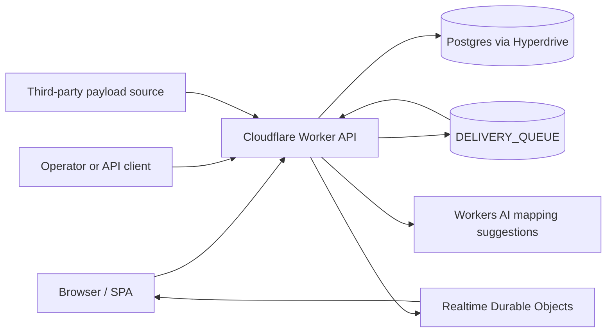

# IngestLens

**AI-assisted integration observability for payload intake, mapping, delivery, and replay-aware debugging.**

Built solo by [Ozby](https://github.com/ozby) as a portfolio of integration primitives: deterministic intake validation, AI-assisted mapping repair, delivery rails, replay, and measurement harnesses for delivery correctness.

## Why this repo is worth reviewing

- **Adaptive intake repair** — detects payload drift, proposes mapping fixes with AI, validates them deterministically, and routes low-confidence cases to human review. ([E2E proof](docs/guides/claim-e2e-traceability.md#shipped-claim-matrix))
- **Delivery primitives with proof** — models queues, topic fan-out, push retries/DLQ, and replay-aware operator workflows. ([E2E proof](docs/guides/claim-e2e-traceability.md#shipped-claim-matrix))
- **Measurement over hand-waving** — ships a consistency lab that compares delivery paths for correctness, latency, and operational cost. ([E2E proof](docs/guides/claim-e2e-traceability.md#shipped-claim-matrix))

## Quick start

```bash
vp install
with-secrets -- vp run dev
```

`vp install` runs `postinstall`, which bootstraps the repo with the same flow
as the repo-owned webpresso setup wrapper. If hooks or bootstrap drift,
diagnose first:

```bash
wp hooks doctor
```

Then repair with:

```bash
wp setup
```

If you are developing against a live webpresso source checkout and the link
breaks, rerun `vp install` here or `vp run dev:link --consumer <repo>` from the
webpresso checkout.

The shared Webpresso/Agent Kit source is
[`webpresso/agent-kit`](https://github.com/webpresso/agent-kit). IngestLens uses
it to keep Claude/Codex instructions, generated hooks, blueprint audits,
secret-safe command wrappers, and local/CI quality gates on one maintained
surface instead of copying agent setup across tools.

Secrets and database connections are managed via `wp config secrets setup` + `with-secrets`. No `.env` files.

## Repo map

- `apps/workers` — Cloudflare Worker API, intake pipeline, auth, delivery, replay
- `apps/client` — React SPA for queues, topics, metrics, and intake review flows
- `apps/lab` — consistency lab UI and workloads for delivery-path comparison
- `packages/*` — shared types, UI, logging, test helpers, lab core
- `infra` — Pulumi-managed Cloudflare infrastructure
- `docs` — architecture, guarantees, ADRs, vision, and project records

## Showcase entrypoints

- **Active cleanup wave:** [`blueprints/in-progress/system-clarity-hardening/_overview.md`](blueprints/in-progress/system-clarity-hardening/_overview.md)
- **Reviewer guide (start here):** [`docs/project/REVIEWER-GUIDE.md`](docs/project/REVIEWER-GUIDE.md)
- **Architecture overview:** [`docs/system-architecture.md`](docs/system-architecture.md)
- **AI intake + mapping flow:** [`docs/architecture.md`](docs/architecture.md)
- **Architecture contract:** [`docs/architecture.contract.json`](docs/architecture.contract.json)
- **Consistency Lab architecture:** [`docs/lab-architecture.md`](docs/lab-architecture.md)
- **Delivery semantics:** [`docs/delivery-guarantees.md`](docs/delivery-guarantees.md)
- **Claim ↔ E2E traceability:** [`docs/guides/claim-e2e-traceability.md`](docs/guides/claim-e2e-traceability.md)
- **Scale and tradeoffs:** [`docs/scale-considerations.md`](docs/scale-considerations.md)
- **Vision + project records:** [`docs/research/product/VISION.md`](docs/research/product/VISION.md), [`docs/project/README.md`](docs/project/README.md)

## Reviewer path

If you are new to the repo and want the fastest technical orientation, use this path:

1. Read the [reviewer guide](docs/project/REVIEWER-GUIDE.md) for the 15-minute walkthrough.
2. Scan the [system architecture](docs/system-architecture.md) for boundaries and request/data flow.
3. Read the [AI intake architecture](docs/architecture.md) and [delivery guarantees](docs/delivery-guarantees.md) to see where the design is intentionally strict.
4. Use the [execution roadmap](docs/project/ROADMAP.md) and the active
   [`system-clarity-hardening` blueprint](blueprints/in-progress/system-clarity-hardening/_overview.md)
   to understand what is stable versus what is being simplified now.

## Engineering proof points

- **Deterministic safety over AI vibes** — model output is contract-checked, confidence-gated, and reviewable before promotion. ([E2E proof](apps/e2e/journeys/intake-mapping-flow.e2e.ts), [browser proof](apps/e2e/journeys/intake-heal-ui.spec.ts))
- **Failure-path honesty** — delivery guarantees, retries, DLQ behavior, and replay semantics are documented as first-class product constraints. ([E2E proof](apps/e2e/journeys/queue-message-flow.e2e.ts), [topic proof](apps/e2e/journeys/topic-publish-flow.e2e.ts), [hardening proof](apps/e2e/journeys/ownership-hardening.e2e.ts))
- **Evidence-backed systems thinking** — the consistency lab compares delivery paths on correctness, latency, and operational cost. ([E2E proof](apps/lab/scenarios/s1a-correctness/test/e2e/full-run.test.ts), [latency proof](apps/lab/scenarios/s1b-latency/test/e2e/full-run.test.ts))

## Architecture at a glance


```mermaid
flowchart LR
    UI[Browser / SPA] --> API[Cloudflare Worker API]
    OPER[Operator or API client] --> API
    SRC[Third-party payload source] --> API
    API --> DB[(Postgres via Hyperdrive)]
    API --> Q[(DELIVERY_QUEUE)]
    Q --> API
    API --> RT[Realtime Durable Objects]
    RT --> UI
    API --> AI[Workers AI mapping suggestions]
```

The Consistency Lab is a separate Worker used to measure delivery-path
behavior, not part of the primary production request path. See
[`docs/lab-architecture.md`](docs/lab-architecture.md).

<details>
<summary>Contributor workflows</summary>

## Verification and demo flows

### E2E

```bash
vp run e2e --suite foundation
vp run e2e --suite full
```

Suites: `foundation`, `auth`, `messaging`, `hardening`, `intake`, `healing`, `demo`, `client`, `branding`, `intake-ui`, `full`.
Browser-backed reviewer proof also lives in `client` and `intake-ui`; see
[`docs/guides/claim-e2e-traceability.md`](docs/guides/claim-e2e-traceability.md).

### Verify

```bash
vp run check
vp run test
vp run build
vp run docs:check
vp run blueprints:check
```

### Local GitHub Actions testing (public Webpresso CI surface)

```bash
vp run act:list
vp run act:ci
vp run act:e2e
vp run act:cleanup
```

### Deploy

```bash
bun ./infra/src/deploy/deploy.ts dev
bun ./infra/src/deploy/deploy.ts prd
```

</details>

## Docs

- [System architecture](docs/system-architecture.md)
- [Architecture](docs/architecture.md)
- [Consistency Lab architecture](docs/lab-architecture.md)
- [Delivery guarantees](docs/delivery-guarantees.md)
- [Claim ↔ E2E traceability](docs/guides/claim-e2e-traceability.md)
- [Scale considerations](docs/scale-considerations.md)
- [ADR index](docs/adrs/README.md)
- [Blueprints](blueprints/README.md)
- [Project records](docs/project/README.md)
