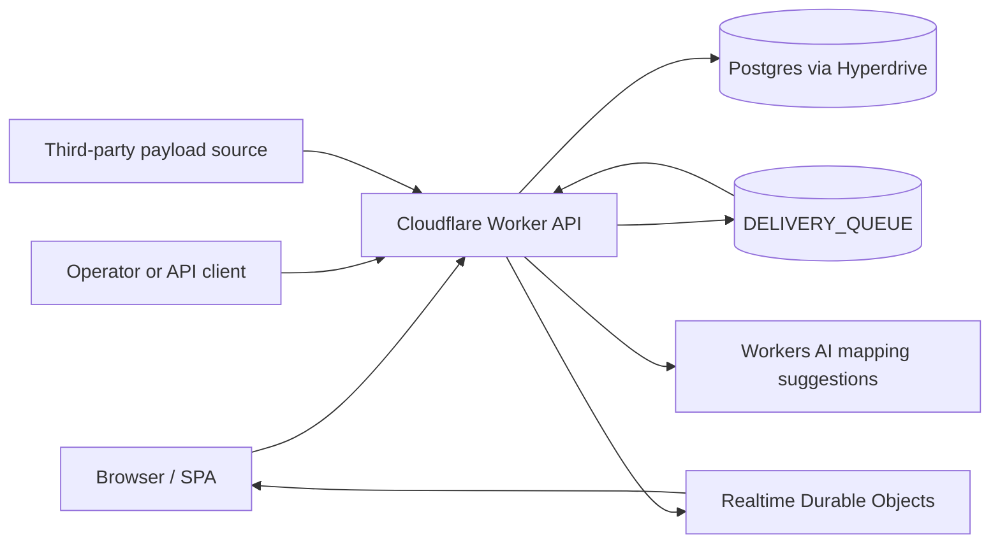

# IngestLens

[](LICENSE)
[](https://github.com/ozby/ingest-lens/actions/workflows/ci.yml)

## What it is

IngestLens is an integration-observability application that validates incoming third-party payloads, AI-repairs broken field mappings, delivers events through queues with retries/DLQ, and lets operators replay and debug delivery — running on Cloudflare Workers.

## Why use it

- **Deterministic safety over AI vibes** — AI mapping proposals are contract-checked, confidence-gated, and routed to human review before promotion.
- **Failure-path honesty** — delivery guarantees, retries, DLQ, and replay semantics are modeled as first-class product constraints, each backed by an E2E proof.
- **Measurement over hand-waving** — a Consistency Lab compares delivery paths on correctness, latency, and operational cost rather than asserting them.

## Quick start

This repo uses [vite-plus](https://github.com/webpresso) (`vp`) as its workspace runner and `with-secrets` (Doppler-wrapped) for secret injection. There are **no `.env` files**.

```bash
vp install
```

Success signal: dependencies install and `postinstall` runs `wp setup` to bootstrap agent hooks/links, completing with no error.

```bash
with-secrets -- vp run dev   # or: pnpm dev
```

Success signal: secrets are injected and the vite-plus dev server / Cloudflare Worker dev process starts and stays running.

Run the dev server without secret injection:

```bash
vp run dev                   # or: pnpm dev:offline
```

Success signal: the dev server starts without secret injection.

## Features

| Feature                                                                                                                                   | Proof                                                                                                                                                                                                                                                  |
| ----------------------------------------------------------------------------------------------------------------------------------------- | ------------------------------------------------------------------------------------------------------------------------------------------------------------------------------------------------------------------------------------------------------ |
| Adaptive intake repair — detect payload drift, AI-propose mapping fixes, validate deterministically, route low-confidence to human review | [`apps/e2e/journeys/intake-mapping-flow.e2e.ts`](apps/e2e/journeys/intake-mapping-flow.e2e.ts), [`apps/e2e/journeys/intake-heal-ui.spec.ts`](apps/e2e/journeys/intake-heal-ui.spec.ts)                                                                 |
| Delivery primitives — queues, topic fan-out, push retries/DLQ, replay-aware operator workflows                                            | [`apps/e2e/journeys/queue-message-flow.e2e.ts`](apps/e2e/journeys/queue-message-flow.e2e.ts), [`apps/e2e/journeys/topic-publish-flow.e2e.ts`](apps/e2e/journeys/topic-publish-flow.e2e.ts)                                                             |
| Ownership/security hardening on delivery paths                                                                                            | [`apps/e2e/journeys/ownership-hardening.e2e.ts`](apps/e2e/journeys/ownership-hardening.e2e.ts)                                                                                                                                                         |
| Consistency Lab — compares delivery paths for correctness, latency, operational cost                                                      | [`apps/lab/scenarios/s1a-correctness/test/e2e/full-run.test.ts`](apps/lab/scenarios/s1a-correctness/test/e2e/full-run.test.ts), [`apps/lab/scenarios/s1b-latency/test/e2e/full-run.test.ts`](apps/lab/scenarios/s1b-latency/test/e2e/full-run.test.ts) |
| Cloudflare Worker API + React Router/React SPA, Postgres via Hyperdrive, DELIVERY_QUEUE, Realtime Durable Objects, Workers AI mapping     | [`apps/workers`](apps/workers), [`apps/client`](apps/client), [`docs/system-architecture.md`](docs/system-architecture.md)                                                                                                                             |
| CI/E2E automation incl. local GitHub Actions via `act` and Neon E2E branch lifecycle                                                      | [`.github/workflows/ci.yml`](.github/workflows/ci.yml), [`.github/workflows/testing-e2e.yml`](.github/workflows/testing-e2e.yml), [`.github/workflows/cleanup-stale-neon-e2e-branches.yml`](.github/workflows/cleanup-stale-neon-e2e-branches.yml)     |
| Agent-kit governance — bundle-budget, catalog-drift, docs-frontmatter, blueprint-lifecycle, architecture-contract audits                  | [`.github/workflows/architecture-contract.yml`](.github/workflows/architecture-contract.yml), [`package.json`](package.json) scripts                                                                                                                   |

## Architecture


```mermaid
flowchart LR
    UI[Browser / SPA] --> API[Cloudflare Worker API]
    OPER[Operator or API client] --> API
    SRC[Third-party payload source] --> API
    API --> DB[(Postgres via Hyperdrive)]
    API --> Q[(DELIVERY_QUEUE)]
    Q --> API
    API --> RT[Realtime Durable Objects]
    RT --> UI
    API --> AI[Workers AI mapping suggestions]
```

The Consistency Lab is a separate Worker used to measure delivery-path behavior; it is not part of the primary production request path. See [`docs/system-architecture.md`](docs/system-architecture.md).

## Verify

Fast contributor check (no secrets required):

```bash
vp run lint          # oxlint + per-package lint
vp run check-types   # tsc, no type errors
vp run test          # vitest suites
```

Full maintainer check (mirrors CI; some steps need secrets / a Neon E2E branch — **maintainer-only**):

```bash
vp check                          # aggregate lint + types + format
vp run build                      # all packages build; client/worker bundles emitted
wp audit docs-frontmatter         # docs frontmatter audit (pnpm docs:check)
wp audit blueprint-lifecycle --legacy-omx   # blueprint lifecycle audit (pnpm blueprints:check)
vp run e2e --suite foundation     # maintainer-only: E2E suite against a Neon E2E branch (or --suite full)
```

## Contribute / Security / License

- Contributing guide: [CONTRIBUTING.md](CONTRIBUTING.md)
- Security policy: [SECURITY.md](SECURITY.md)
- Code of conduct: [CODE_OF_CONDUCT.md](CODE_OF_CONDUCT.md)
- License: [MIT](LICENSE)
- Vision: [VISION.md](VISION.md)

## Docs

- [System architecture](docs/system-architecture.md)
- [Architecture](docs/architecture.md)
- [Delivery guarantees](docs/delivery-guarantees.md)
- [Claim ↔ E2E traceability](docs/guides/claim-e2e-traceability.md)
- [Reviewer guide](docs/project/REVIEWER-GUIDE.md)
- [ADR index](docs/adrs/README.md)
- [Blueprints](blueprints/README.md)
- [Project records](docs/project/README.md)
