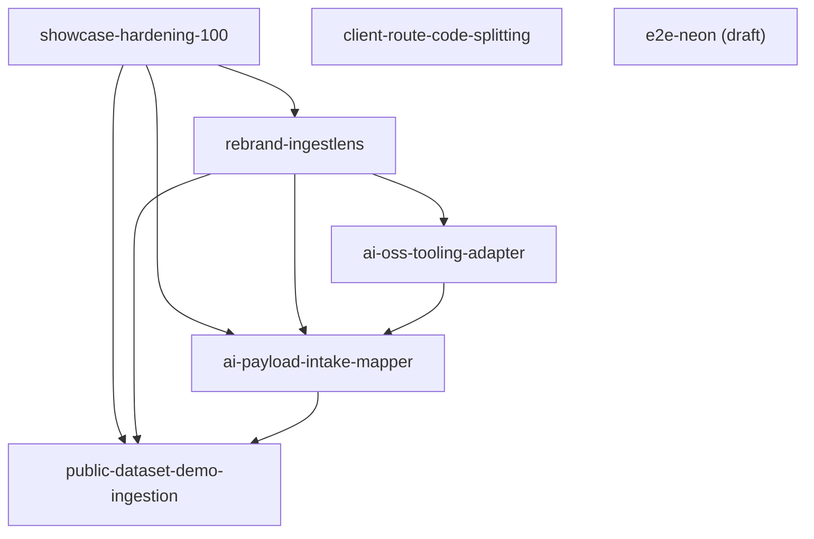

# Execution Roadmap

Current as of: 2026-04-24

Vision and public positioning live in [`docs/research/product/VISION.md`](docs/research/product/VISION.md); this file is execution sequencing only.

## Completed

| Blueprint                          | Goal                                            |
| ---------------------------------- | ----------------------------------------------- |
| pnpm-catalogs-adoption             | Standardise deps via pnpm catalogs              |
| vite-plus-migration                | Replace Turbo with Vite Plus                    |
| commit-hooks-guardrails            | Husky + lint-staged + commitlint + secretlint   |
| doppler-secrets                    | Config inheritance via Doppler                  |
| ci-hardening                       | GitHub Actions gates + setup action             |
| cloudflare-pulumi-infra            | Pulumi IaC for CF infrastructure                |
| workers-hono-port                  | Hard-cut Express → Hono/Workers + Drizzle       |
| stryker-mutation-guardrails        | Per-package mutation testing + CI gate          |
| adr-lore-commit-protocol           | ADR system + lore commit trailers               |
| integration-payload-mapper-dataset | Dataset + eval harness for payload mapper       |
| agents-md-principal-rewrite        | CLAUDE.md principal-level rewrite               |
| cf-rate-limiting                   | Rate limiter middleware for Workers             |
| analytics-engine-telemetry         | Delivery-attempt telemetry via Analytics Engine |
| durable-objects-fan-out            | TopicRoom DO for WebSocket fan-out              |
| message-replay-cursor              | Postgres seq + DO cursor replay                 |

## Wave 1 — Engineering rigor first

Objective: prove the substrate is trustworthy before public polish or AI features.

| Blueprint                                                                                    | Goal                                                                            | Why first                                                                   |
| -------------------------------------------------------------------------------------------- | ------------------------------------------------------------------------------- | --------------------------------------------------------------------------- |
| [`showcase-hardening-100`](blueprints/planned/showcase-hardening-100/_overview.md)           | Close security, contract, typecheck, CI, dependency, test, and metrics blockers | AI/branding polish over broken fundamentals would hurt the interview signal |
| [`client-route-code-splitting`](blueprints/planned/client-route-code-splitting/_overview.md) | Remove the Vite large-chunk warning and add a bundle budget gate                | Can run in parallel with hardening if file conflicts are managed            |

## Wave 2 — Public identity

Objective: align public surfaces around IngestLens without overclaiming planned behavior.

| Blueprint                                                                  | Goal                                                   | Depends on               |
| -------------------------------------------------------------------------- | ------------------------------------------------------ | ------------------------ |
| [`rebrand-ingestlens`](blueprints/planned/rebrand-ingestlens/_overview.md) | Rebrand public surfaces from node-pubsub to IngestLens | `showcase-hardening-100` |

## Wave 3 — Integration-platform AI showcase

Objective: deliver the intake → mapping → approval → normalized event → observability demo.

| Blueprint                                                                                        | Goal                                                                                  | Depends on                                                                 |
| ------------------------------------------------------------------------------------------------ | ------------------------------------------------------------------------------------- | -------------------------------------------------------------------------- |
| [`ai-oss-tooling-adapter`](blueprints/planned/ai-oss-tooling-adapter/_overview.md)               | Adopt the minimal OSS AI/validation stack behind one Worker adapter                   | `rebrand-ingestlens`                                                       |
| [`ai-payload-intake-mapper`](blueprints/planned/ai-payload-intake-mapper/_overview.md)           | Add Workers AI suggestion-only payload mapping with validation and approval           | `showcase-hardening-100`, `rebrand-ingestlens`, `ai-oss-tooling-adapter`   |
| [`public-dataset-demo-ingestion`](blueprints/planned/public-dataset-demo-ingestion/_overview.md) | Package the demo around public ATS fixture data and optional allowlisted live fetches | `showcase-hardening-100`, `rebrand-ingestlens`, `ai-payload-intake-mapper` |

## Active execution DAG

Source of truth: direct edges below come from active blueprint frontmatter
(`depends_on`) as of 2026-04-24. The wave tables above are the human execution
grouping; this DAG is the machine-friendly dependency view for parallel lane
planning.

## Parallel execution read

- **Ready now:** `showcase-hardening-100`, `client-route-code-splitting`
- **Blocked until predecessors land:** `rebrand-ingestlens`,
  `ai-oss-tooling-adapter`, `ai-payload-intake-mapper`,
  `public-dataset-demo-ingestion`
- **Not yet schedulable as an execution lane:** `e2e-neon` remains `draft` and
  is intentionally excluded from the runnable DAG until promoted to
  `planned`/`in-progress`

### Shared-file choke points

- `ai-payload-intake-mapper` and `public-dataset-demo-ingestion` converge on
  the same intake route, admin UI, API client, and mapping review components;
  they should stay serialized.
- `ai-payload-intake-mapper` and `ai-oss-tooling-adapter` both own the intake
  adapter boundary (`apps/workers/src/intake/aiMappingAdapter.ts`),
  `packages/types/IntakeMapping.ts`, worker package metadata, and
  `apps/workers/wrangler.toml`; the adapter blueprint should land first.
- `rebrand-ingestlens` and `showcase-hardening-100` both touch
  `apps/client/src/components/Sidebar.tsx` and docs/template cleanup surfaces,
  so rebrand should wait for hardening completion as already modeled above.
- `client-route-code-splitting` is mostly independent, but it shares
  `apps/client/src/App.tsx` with `ai-payload-intake-mapper` and root manifest
  surfaces with hardening, so it is safest either alongside hardening or before
  the AI intake wave.

## Key constraints

- Use pinned public fixtures by default; optional live public ATS fetches must be allowlisted, cached, and disabled by default.
- No paid SaaS dependency and no full connector marketplace.
- Roll out the generated `messages.seq` migration before enabling reconnect replay broadly on the WebSocket path in production.
- Treat `docs/research/product/VISION.md` as the product source of truth and `docs/research/2026-04-24-messy-hr-ats-data-demo-sources.md` as the messy-data research source.
