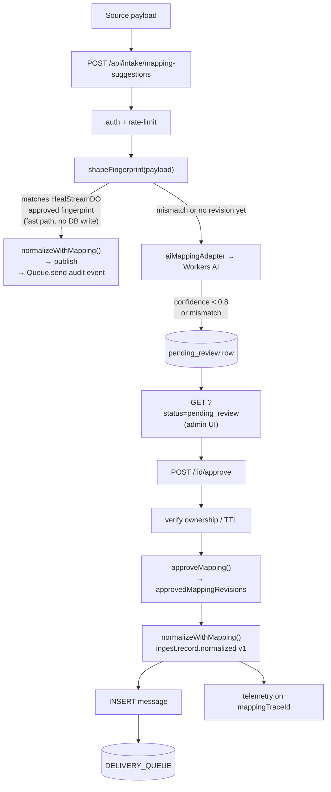
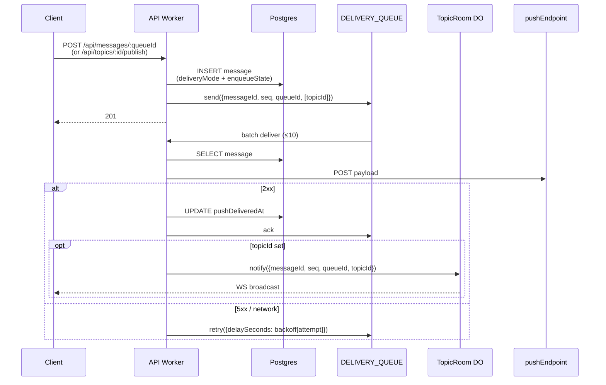

# Architecture

Top-level mermaid view: [`system-architecture.md`](./system-architecture.md).
Delivery contract: [`delivery-guarantees.md`](./delivery-guarantees.md).

## Constraints

- Workers run in V8 isolates; no in-process retries, no long-lived DB
  connections. All durable state lives in Postgres, Cloudflare Queues,
  or Durable Objects.
- One Postgres region. Production tables under `public.*`, lab tables
  under `lab.*` (CI-enforced).

## Components

### API worker (`apps/workers`, Hono)

Entry: `src/index.ts`. Exports `fetch` (HTTP) and `queue` (delivery
consumer) sharing one `Env`. Routes under `src/routes/`. Auth via JWT
with best-effort KV jti revocation; rate-limited via `API` and `AUTH_RATE_LIMITER`
bindings.

### Hyperdrive

Per-PoP pool fronting Postgres. Worker uses
`env.HYPERDRIVE.connectionString`. Read cache disabled in `wrangler dev`
— cache-dependent latency is not testable locally.
See [ADR 003](decisions/003-hyperdrive-connection-pooling.md).

### Postgres integrity boundary

Postgres is not just a blob store for Worker state. The schema now carries
the key ownership assumptions the routes rely on:

- `messages.queue_id -> queues.id` (`ON DELETE CASCADE`)
- `queue_metrics.queue_id -> queues.id` (`ON DELETE CASCADE`)
- `topic_subscriptions.{topic_id,queue_id}` -> `topics/queues` (`ON DELETE CASCADE`)
- `queues/topics/intake_attempts/approved_mapping_revisions.owner_id -> users.id` (`ON DELETE CASCADE`)
- `approved_mapping_revisions.intake_attempt_id -> intake_attempts.id` (`ON DELETE CASCADE`)

That keeps queue/topic deletes from depending on manual application cleanup
for core relational integrity, and it makes `ownerId` an actual database-level
tenant boundary rather than only a routing convention.

### Cloudflare Queues (delivery)

Publish enqueues a payload onto `DELIVERY_QUEUE`. Consumer
(`src/consumers/deliveryConsumer.ts`) processes batches of 10:

1. Load message from Postgres.
2. POST to `pushEndpoint`.
3. 2xx → record `pushDeliveredAt` then `ack`; 5xx/network → `retry({ delaySeconds })`
   with backoff.
4. Missing row → `ack` (safe drop).

`max_retries = 5` then `delivery-dlq`. **At-least-once.** Receivers must
be idempotent; publishers can dedupe via `Idempotency-Key`. Postgres is the
durable message/outbox record; Cloudflare Queue is the push trigger.

### TopicRoom Durable Object

One DO per topic. WebSocket hibernation API. On consumer ack with a
`topicId`, the DO broadcasts to connected sockets and writes to a short
SQLite replay log. `GET /api/topics/:id/ws?cursor=<c>` replays missed
messages. O(n) fan-out per topic — see
[scale-considerations.md](scale-considerations.md) for sharding.

## IngestLens AI intake

Single AI call site: mapping repair suggestion. Input: bounded source
payload, target contract, current approved mapping revision, prompt
version. Output: suggested source paths, drift categories, missing /
ambiguous fields, confidence, notes. Everything after that
(schema/source-path validation, compatibility, approval, normalization,
publish, telemetry, retention, replay) is deterministic.

ADR: [0004](adrs/0004-ingestlens-ai-intake-architecture.md).
Self-healing stream design: `~/.gstack/projects/ozby-ingest-lens/ozby-main-design-20260426-195719.md`.

### Human review path (v1 baseline)



### Self-healing path (adaptive intake)

When `shapeFingerprint()` detects structural drift and the LLM returns
confidence ≥ 0.8, the auto-heal path can approve without human review.
`HealStreamDO` serializes the heal decision and live SSE stream; the Worker
persists the approved revision / attempt rows in Postgres and then publishes
the normalized record. Operators observe via SSE and can revert via PATCH.

```mermaid
sequenceDiagram
  participant SRC as Third-party source
  participant W as API Worker
  participant HS as HealStreamDO
  participant PG as Postgres (Neon)
  participant OPER as Operator (SSE)

  SRC->>W: POST /api/intake/mapping-suggestions<br/>(renamed field)
  W->>W: shapeFingerprint(payload) ≠ cached fingerprint
  W->>W: suggestMappings() — Workers AI
  Note over W: confidence ≥ 0.8
  W->>HS: tryHeal(batch) via DO fetch
  HS->>HS: serialize heal + update live cache / SSE state
  HS-->>OPER: SSE: drift_detected → analyzing → healed<br/>(analyzing confidence is placeholder; real LLM<br/>confidence available after suggestMappings() returns)
  W->>PG: INSERT approvedMappingRevisions + intakeAttempts<br/>(healedAt = now)
  W->>W: normalizeWithMapping(new suggestions)
  W->>PG: persist publish record(s)
  W-->>SRC: 200 (normalized record)

  Note over OPER: Operator inspects heal, decides to revert
  OPER->>W: PATCH /api/heal/stream/.../rollback
  W->>HS: rollback(currentRevisionId)
  HS->>PG: INSERT approvedMappingRevisions<br/>(rolledBackFrom = currentId)
  HS->>HS: restore previous {fingerprint, suggestions}
  HS-->>OPER: SSE: rolled_back

  Note over SRC: Next payload with same renamed field
  SRC->>W: POST /api/intake/mapping-suggestions
  W->>HS: getState() — fingerprint mismatch (reverted)
  W->>W: suggestMappings() → confidence < 0.8 (or pending_review)
```

```text
GET  /api/intake/public-fixtures              list bundled ATS fixtures
GET  /api/intake/public-fixtures/:fixtureId      single fixture by ID
POST /api/intake/mapping-suggestions          auth → shapeFingerprint → fast path or AI adapter → persist
GET  /api/intake/mapping-suggestions?status=pending_review
POST /api/intake/mapping-suggestions/:id/approve
       → verify ownership, reject expired payloads
       → approveMapping() → create approved mapping revision
       → normalizeWithMapping() → insert message → DELIVERY_QUEUE
       → emit telemetry on shared mappingTraceId
POST /api/intake/mapping-suggestions/:id/reject
       → verify ownership → mark attempt as rejected with reason

GET  /api/heal/stream/:sourceSystem/:contractId/:contractVersion
       → SSE stream; events: drift_detected | analyzing | rewriting | healed | deferred | rolled_back
       → keepalive every 15s
PATCH /api/heal/stream/:sourceSystem/:contractId/:contractVersion/rollback
       → verify ownership → load current + previous revisions
       → HealStreamDO.rollback() via DO fetch
       → insert new approvedMappingRevisions (rolledBackFrom = currentId)
       → SSE: rolled_back
```

**HealStreamDO invariants:**

- One DO instance per `sourceSystem:contractId:contractVersion` tuple.
- DO input gate serializes all concurrent heal/rollback writes — no application-level locking needed.
- Live-state ordering: `HealStreamDO.tryHeal()` owns serialized in-memory / SQLite cache updates and SSE;
  the Worker owns Postgres persistence and publish completion for the auto-heal path.
- Audit trail: `approvedMappingRevisions` is append-only. `healedAt` marks auto-heals; `rolledBackFrom` links rollback rows to the reversed revision.
- Communication between Worker and HealStreamDO uses `stub.fetch()` (HTTP over DO), not DO RPC.
- The SSE `analyzing` event broadcasts a hardcoded `confidence: 0.9` placeholder; the real LLM
  confidence is only available in the Worker after `suggestMappings()` returns and is stored in `overallConfidence` on the `intakeAttempts` row.

Fixture source bundled into Worker code from
`data/payload-mapper/payloads/ats/open-apply-sample.jsonl` — no runtime
filesystem dependency.

## Request lifecycle



### Direct queue publish

```
POST /api/messages/:queueId
  → auth → INSERT message via unique (queueId, idempotencyKey) guard
  → persist deliveryMode + enqueueState on the message row
  → if queue.pushEndpoint: DELIVERY_QUEUE.send({ messageId, seq, queueId, pushEndpoint, attempt: 0 })
  → enqueue success marks enqueueState = enqueued; enqueue failure marks enqueueState = failed and is surfaced to caller

GET /api/messages/:queueId
  → auth → atomic lease claim in Postgres (`FOR UPDATE SKIP LOCKED`)
  → only deliveryMode = pull and non-expired rows are claimable
  → leased rows return with received/visibility fields already updated
```

Source: `src/routes/message.ts`.

### Topic fan-out

```
POST /api/topics/:topicId/publish
  → auth → SELECT topic + subscribed queues
  → transactionally persist one message per subscribed queue
  → after commit, enqueue push-targeted rows with topicId
  → if enqueue fails, message rows remain durable with enqueueState = failed and the route returns 502
```

Source: `src/routes/topic.ts`.

### Delivery consumer

```
DELIVERY_QUEUE batch (≤10)
  → SELECT message; missing → ack
  → POST pushEndpoint
  → 2xx: UPDATE pushDeliveredAt, ack; if topicId: notify TopicRoom { messageId, seq, queueId, topicId }
  → 5xx/error: retry({ delaySeconds: backoff[attempt] })
```

Source: `src/consumers/deliveryConsumer.ts`.

## Consistency Lab (`apps/lab`)

Separate worker. Empirically measures ordering and latency across three
delivery paths. Gated by `KillSwitchKV` and a $50/day cost ceiling
(`CostEstimatorCron` auto-flips the switch).

```mermaid
flowchart LR
  B[Browser] --> L[apps/lab Hono SSR + htmx]
  L --> KS{KILL_SWITCH_KV}
  KS -->|off| X[404]
  KS -->|on| SL[SessionLock]
  SL --> G[LabConcurrencyGauge]
  G --> S1A[S1aRunnerDO<br/>correctness<br/>(@repo/lab-s1a-correctness)]
  G --> S1B[S1bRunnerDO<br/>latency<br/>(@repo/lab-s1b-latency)]
  S1A --> P1[CfQueues path]
  S1A --> P2[PgPolling path]
  S1A --> P3["PgDirectNotify path<br/>(DO connect TCP)"]
  S1B --> P1
  S1B --> P2
  S1B --> P3
  P1 --> PG[("Postgres lab.*")]
  P2 --> PG
  P3 --> PG
  S1A --> TC[TelemetryCollector ~10Hz]
  S1B --> TC
  TC -->|SSE| B
  TC --> EA[(lab.events_archive)]
  HC["HeartbeatCron 15m / 10k weekly<br/>(+ CostEstimator on same tick)"] --> S1A
  CHR[CostEstimatorCron $50/day] -->|auto-flip| KS
```

```text
Browser → apps/lab (Hono SSR + htmx)
  ├ KILL_SWITCH_KV middleware (404 the surface when off)
  ├ SessionLock (alarm-backed TTL, single-writer per scenario)
  ├ LabConcurrencyGauge (global cap: 100 sessions)
  ├ S1aRunnerDO — correctness across CfQueues / PgPolling / PgDirectNotify
  │     → delivered, duplicate, inversion counts; Kendall-tau classifier
  ├ S1bRunnerDO — latency: p50/p95/p99 + PricingTable annotation
  ├ TelemetryCollector — batches ScenarioEvents at ~10Hz; persists to lab.events_archive
  ├ HeartbeatCron (15-min synthetic; 10k weekly, cost estimator on same tick)
  ├ CostEstimatorCron ($50/day auto-flip, runs inside the same `*/15` cron tick as heartbeat)
  └ Workers Assets — CSS + htmx.min.js + htmx-ext-sse.js
```

Notes:

- `PgDirectNotify` uses CF Workers `connect()` from a DO; Hyperdrive
  does not support LISTEN/NOTIFY (probe p01).
- Histogram uses an inline ~200-line t-digest (Dunning 2019 reference);
  `@thi.ng/tdigest` does not exist.
- `scripts/check-lab-migrations.ts` rejects any migration touching
  `public.` from the lab.
- `CostEstimatorCron` does not have its own cron schedule; it runs
  alongside `HeartbeatCron` on the same `*/15 * * * *` tick
  (`apps/lab/src/index.ts:69-99`).

| Package                     | Provides                                                                                       |
| --------------------------- | ---------------------------------------------------------------------------------------------- |
| `packages/lab-core`         | SessionLock, gauge, sanitizer, telemetry, kill switch, histogram, schema                       |
| `@repo/lab-s1a-correctness` | S1aRunnerDO — correctness scenario runner via CFQueues / PgPolling / PgDirectNotify            |
| `@repo/lab-s1b-latency`     | S1bRunnerDO — latency scenario runner with p50/p95/p99 + PricingTable annotation               |
| `packages/test-utils`       | `deepFreeze` re-export (cross-package)                                                         |
| `apps/lab`                  | Hono SSR shell, Workers Assets, crons, re-exports S1a/S1b DOs for Wrangler migration detection |

Admin bypass actions write `lab.heartbeat_audit` rows with constant-time
token comparison. All events pass through `Sanitizer`
(allowlist-only, default-deny).

## What this is not

- **Not a message broker.** No ordering guarantee, no consumer groups,
  no offset tracking.
- **Not a full browser messaging platform.** WS fan-out + short replay,
  yes; client SDK, durable per-user cursor store, long-term archive, no.
- **Not multi-region.** Single Postgres region.
- **Not a global quota system.** Per-PoP token bucket only
  ([ADR 0004](decisions/004-per-pop-rate-limiting.md)).
