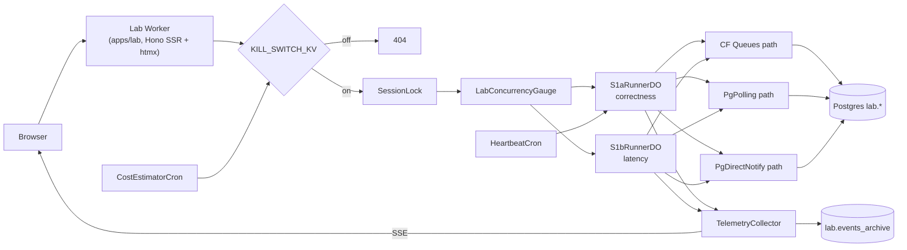

# Consistency Lab Architecture

The Consistency Lab (`apps/lab`) is a separate Worker used to measure ordering,
latency, and operational cost across multiple delivery paths. It is isolated
from the main production request path and only shares the underlying Neon
project through the `lab.*` schema boundary.

Top-level production topology lives in
[`system-architecture.md`](./system-architecture.md). Core runtime request and
intake behavior live in [`architecture.md`](./architecture.md).

## Lab runtime

## Runtime notes

- **Dedicated Worker surface**: `apps/lab/src/index.ts` serves the Lab UI, run
  routes, and SSE session stream separately from `apps/workers`.
- **Kill switch first**: all `/lab/*` routes pass through `KILL_SWITCH_KV`
  middleware and return `404` when the surface is disabled.
- **Runner isolation**: `SessionLock` enforces single-writer behavior per
  scenario run, while `LabConcurrencyGauge` caps global concurrent sessions.
- **Scenario DOs**:
  - `S1aRunnerDO` measures correctness across CF Queues, Postgres polling, and
    Postgres direct notify.
  - `S1bRunnerDO` measures latency across the same paths.
- **Telemetry path**: scenario events are batched into SSE for the browser and
  archived in `lab.events_archive`.
- **Cron controls**: heartbeat traffic and cost estimation run on the Lab
  Worker schedule; the cost estimator can auto-disable the surface when the
  budget ceiling is exceeded.

## Operational details

- `PgDirectNotify` uses Workers `connect()` from a DO because Hyperdrive does
  not support `LISTEN/NOTIFY`.
- `scripts/check-lab-migrations.ts` rejects migrations that touch `public.*`
  from the Lab surface.
- Admin bypass actions write `lab.heartbeat_audit` rows with constant-time
  token comparison.
- All events pass through `Sanitizer` (allowlist-only, default-deny).

## Package boundaries

| Package                     | Provides                                                                             |
| --------------------------- | ------------------------------------------------------------------------------------ |
| `packages/lab-core`         | SessionLock, gauge, sanitizer, telemetry, kill switch, histogram, schema             |
| `@repo/lab-s1a-correctness` | S1aRunnerDO — correctness scenario runner via CF Queues / PgPolling / PgDirectNotify |
| `@repo/lab-s1b-latency`     | S1bRunnerDO — latency scenario runner with p50/p95/p99 + PricingTable annotation     |
| `apps/lab`                  | Hono SSR shell, routes, crons, assets, and Wrangler-visible DO re-exports            |

## Related

- [System architecture](./system-architecture.md)
- [Architecture](./architecture.md)
- [Consistency Lab runbook](./runbooks/consistency-lab.md)
