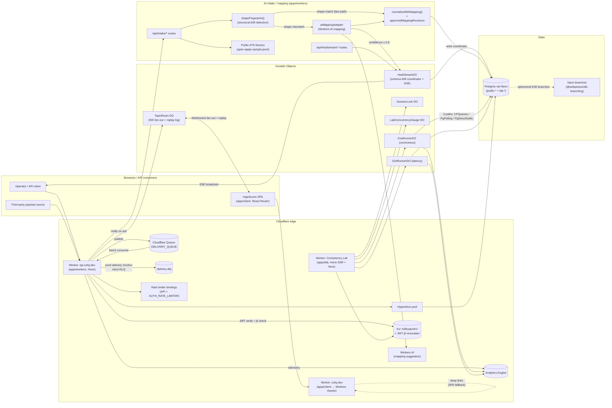

# System Architecture

End-to-end view of IngestLens: edge entrypoints, Worker apps, durable
state, AI mapping path, and Consistency Lab. Treat this as the canonical
mermaid chart for the repo. Component-level invariants and code paths
live in [`architecture.md`](./architecture.md).

## Top-level diagram

## Layer notes

- **Edge SPA worker** (`apps/client`): Workers Assets host with SPA
  fallback for deep links. No server-side rendering.
- **API worker** (`apps/workers`): Hono on Cloudflare Workers. Owns
  auth, queue/topic CRUD, push delivery consumer, AI intake routes,
  WebSocket upgrade for `TopicRoom` DOs.
- **Lab worker** (`apps/lab`): Hono SSR + htmx; isolated kill switch,
  cost ceiling, and SessionLock-gated runners. Never shares state with
  the API worker beyond the `lab.*` schema.
- **Durable Objects**: `TopicRoom` is the production fan-out + reconnect
  replay primitive; `HealStreamDO` (one per `sourceSystem:contractId:contractVersion`)
  is the write coordinator for schema drift healing — it serializes concurrent
  heal writes via the CF input gate and broadcasts SSE events to operator
  subscribers; `SessionLock`, `LabConcurrencyGauge`, and the two scenario runner
  DOs are lab-internal.
- **Postgres**: single Neon project. Production tables live in
  `public.*`; lab tables strictly under `lab.*` (CI-enforced).
  `@webpresso/db-branching` provides the vendor-agnostic interface;
  `packages/neon` is the Neon implementation used in E2E.
- **AI intake path**: only AI call site is mapping repair suggestion.
  `shapeFingerprint()` detects structural drift before calling the LLM.
  On shape-match (fast path) the LLM is skipped entirely; on mismatch at
  ≥ 0.8 confidence `HealStreamDO.tryHeal()` auto-approves the new mapping.
  Every step after mapping approval — schema validation, normalization,
  publish — is deterministic code.
- **Workers test substrate**: `@webpresso/workers-test-kit` is the
  upstream for `BaseWorkerEnv`, `createMockExecutionContext`, and
  `createMockHyperdrive`. `packages/test-utils` only re-exports
  `deepFreeze` for cross-package use.

## Cross-cutting concerns

| Concern          | Where it lives                                                      |
| ---------------- | ------------------------------------------------------------------- |
| Auth             | `apps/workers/src/middleware/auth.ts` + KV jti revocation (h-001)   |
| Rate limiting    | API + `AUTH_RATE_LIMITER` bindings (per-PoP token bucket, ADR 0004) |
| Telemetry        | Analytics Engine — `analytics-engine-telemetry` blueprint           |
| Replay           | `TopicRoom` DO + Postgres `messages.seq` (`message-replay-cursor`)  |
| Bundle budgets   | `pnpm client:bundle:check` (`client-route-code-splitting`)          |
| Mutation testing | Stryker per-package + CI gate (`stryker-mutation-guardrails`)       |
| Doppler secrets  | `bun ./scripts/with-doppler.ts` wrapper (no `.env`)                 |

## Related

- [Architecture (component detail)](./architecture.md)
- [Delivery guarantees](./delivery-guarantees.md)
- [Scale considerations](./scale-considerations.md)
- [ADR index](./adrs/README.md)
- [Roadmap](../ROADMAP.md)
