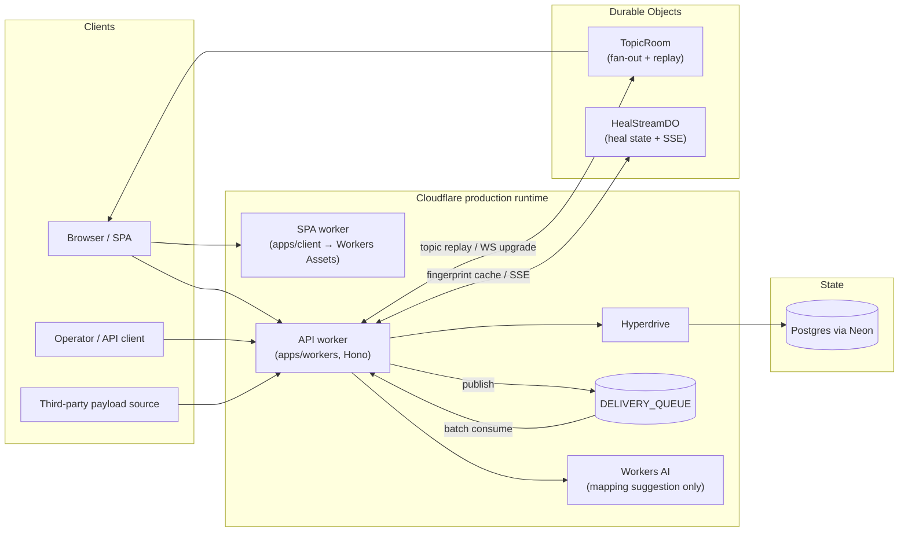

# System Architecture

Primary production runtime for IngestLens: the client surface, API worker,
durable state, delivery rails, and adaptive intake boundary. Treat this as the
canonical top-level diagram for the shipped system. Detailed flow behavior
lives in [`architecture.md`](./architecture.md). The separate Consistency Lab
is documented in [`lab-architecture.md`](./lab-architecture.md). Reviewer-facing
claim proof lives in [`./guides/claim-e2e-traceability.md`](./guides/claim-e2e-traceability.md).

## Primary production runtime

```mermaid
flowchart LR
  subgraph CLIENT["Clients"]
    UI["Browser / SPA"]
    OPER["Operator / API client"]
    SRC["Third-party payload source"]
  end

  subgraph EDGE["Cloudflare production runtime"]
    SPA["SPA worker<br/>(apps/client → Workers Assets)"]
    API["API worker<br/>(apps/workers, Hono)"]
    HD["Hyperdrive"]
    DQ[("DELIVERY_QUEUE")]
    AI["Workers AI<br/>(mapping suggestion only)"]
  end

  subgraph REALTIME["Durable Objects"]
    TR["TopicRoom<br/>(fan-out + replay)"]
    HS["HealStreamDO<br/>(heal state + SSE)"]
  end

  subgraph DATA["State"]
    PG[("Postgres via Neon")]
  end

  UI --> SPA
  UI --> API
  OPER --> API
  SRC --> API

  API --> HD --> PG
  API -->|publish| DQ
  DQ -->|batch consume| API
  API <-->|topic replay / WS upgrade| TR
  TR --> UI
  API <-->|fingerprint cache / SSE| HS
  API --> AI
```

## What this diagram is responsible for

- **Major runtime parts only**: browser/client entrypoints, the API Worker,
  state, delivery rails, realtime primitives, and the single AI boundary.
- **Production request path only**: route-level branching, confidence
  thresholds, KV bindings, telemetry sinks, and branch-management details are
  intentionally left to the detailed docs.
- **Separate lab surface**: the Consistency Lab runs as its own Worker with its
  own DOs, middleware, and crons; it is not a dependency of the production
  request path.

## Runtime notes

- **Edge SPA worker** (`apps/client`): Workers Assets host with SPA fallback
  for deep links. No server-side rendering. In the browser code, transport is
  intentionally split from UI notifications: `src/services/api-client.ts` owns
  HTTP/envelope behavior, while `src/services/api.ts` is the app-facing wrapper
  that wires toast behavior.
  Executable proof: [`../apps/e2e/journeys/client-surfaces.spec.ts`](../apps/e2e/journeys/client-surfaces.spec.ts), [`../apps/e2e/journeys/ingestlens-branding.e2e.ts`](../apps/e2e/journeys/ingestlens-branding.e2e.ts).
- **API worker** (`apps/workers`): Hono on Cloudflare Workers. Owns auth,
  queue/topic CRUD, push delivery consumer, AI intake routes, and WebSocket
  upgrade for `TopicRoom` DOs.
  Executable proof: [`../apps/e2e/journeys/worker-health.e2e.ts`](../apps/e2e/journeys/worker-health.e2e.ts), [`../apps/e2e/journeys/auth-session.e2e.ts`](../apps/e2e/journeys/auth-session.e2e.ts), [`../apps/e2e/journeys/ownership-hardening.e2e.ts`](../apps/e2e/journeys/ownership-hardening.e2e.ts).
- **Durable Objects**: `TopicRoom` is the production fan-out + reconnect replay
  primitive. `HealStreamDO` (one per
  `sourceSystem:contractId:contractVersion`) serializes adaptive-heal state,
  exposes the SSE stream, and lets the Worker skip or approve repair paths
  without using Postgres as the hot-path cache.
  Executable proof: [`../apps/e2e/journeys/topic-publish-flow.e2e.ts`](../apps/e2e/journeys/topic-publish-flow.e2e.ts), [`../apps/e2e/journeys/self-healing-intake.e2e.ts`](../apps/e2e/journeys/self-healing-intake.e2e.ts).
- **Postgres**: single Neon-backed database. Production tables live in
  `public.*`; the Lab uses `lab.*` only. Hyperdrive is the Worker runtime pool.
- **AI intake path**: the only model call site is mapping repair suggestion.
  `shapeFingerprint()` decides whether the Worker can take a deterministic fast
  path or needs a Workers AI suggestion. Everything after mapping approval
  remains deterministic code.

## Cross-cutting concerns

| Concern         | Where it lives                                                                   |
| --------------- | -------------------------------------------------------------------------------- |
| Auth            | `apps/workers/src/middleware/auth.ts` + best-effort KV-backed JWT revocation     |
| Rate limiting   | API + `AUTH_RATE_LIMITER` bindings (per-PoP token bucket, ADR 0004)              |
| Replay          | `TopicRoom` DO + Postgres `messages.seq`                                         |
| Delivery policy | `docs/delivery-guarantees.md` + `apps/workers/src/consumers/deliveryConsumer.ts` |
| AI safety       | `docs/architecture.md` + ADR 0004; deterministic validation after AI output      |
| Secrets         | `with-secrets -- <cmd>` + `wp config secrets` contract (no `.env`)               |

## Separate subsystem: Consistency Lab

The Consistency Lab (`apps/lab`) is intentionally not shown in the primary
runtime diagram. It is a separate Worker used to measure delivery-path behavior
under isolated controls such as `KILL_SWITCH_KV`, scenario runner DOs, and
cost-ceiling crons. See [`lab-architecture.md`](./lab-architecture.md).

## Related

- [Architecture (component detail)](./architecture.md)
- [Consistency Lab architecture](./lab-architecture.md)
- [Delivery guarantees](./delivery-guarantees.md)
- [Scale considerations](./scale-considerations.md)
- [ADR index](./adrs/README.md)
- [Project records](./project/README.md)
